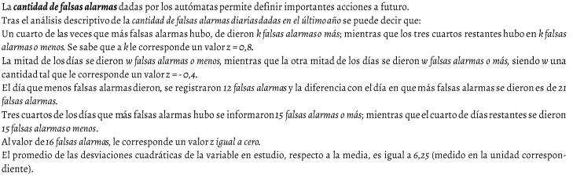

# JUSTIFICACION.md - Proyecto Backgammon

## Índice
1. [Resumen del Diseño General](#1-resumen-del-diseño-general)
2. [Justificación de las Clases Elegidas](#2-justificación-de-las-clases-elegidas)
3. [Justificación de Atributos](#3-justificación-de-atributos)
4. [Decisiones de Diseño Relevantes](#4-decisiones-de-diseño-relevantes)
5. [Excepciones y Manejo de Errores](#5-excepciones-y-manejo-de-errores)
6. [Estrategias de Testing y Cobertura](#6-estrategias-de-testing-y-cobertura)
7. [Principios SOLID](#7-principios-solid)
8. [Anexos: Diagrama UML](#8-anexos-diagrama-uml)

---

## 1. Resumen del Diseño General

El proyecto implementa un juego completo de Backgammon siguiendo una arquitectura por capas que separa claramente las responsabilidades entre presentación, lógica de coordinación y dominio del juego.

### Arquitectura del Sistema

El sistema se divide en tres capas principales:

- **Capa de Presentación (CLI)**: Maneja la interacción con el usuario
- **Capa de Lógica (BackgammonGame)**: Coordina el flujo general del juego
- **Capa de Dominio (Board, Player, Dice, Checker)**: Implementa las reglas y entidades del juego

### Características Principales

- Separación completa entre lógica de negocio e interfaz de usuario
- Encapsulación total con atributos privados usando nomenclatura `__atributo__`
- Inmutabilidad en clases de entidades fundamentales
- Validaciones exhaustivas en todas las operaciones críticas
- Cobertura de testing del 84% con objetivo de alcanzar 90%

### Módulos del Sistema

**Core (Lógica de Negocio)**
- BackgammonGame: Coordinador principal del juego
- Board: Representación del tablero y contenedores
- Player: Entidad que representa a cada jugador
- Checker: Ficha del juego
- Dice: Gestión de dados y movimientos disponibles
- DiceRoller: Generador de números aleatorios
- ColorFicha: Enumeración de colores válidos
- BoardInitializer: Configuración inicial del tablero
- MoveExecutor: Ejecución y validación de movimientos

**CLI (Interfaz de Usuario)**
- CLI: Interfaz de línea de comandos con menús interactivos

---

## 2. Justificación de las Clases Elegidas

### 2.1 BackgammonGame

**Responsabilidad**: Coordinar el flujo general del juego.

**Justificación**: Actúa como controlador principal que orquesta todas las operaciones del juego. Gestiona el estado global del tablero, jugadores, dados y turnos. Controla las condiciones de inicio y finalización de partida e implementa reglas de alto nivel como bear off, manejo de barra y detección de victoria.

**Necesidad**: Centraliza el control del flujo del juego evitando que la lógica esté dispersa entre múltiples componentes. Proporciona una API clara para que las interfaces de usuario interactúen con el juego.

---

### 2.2 Board

**Responsabilidad**: Representar el estado del tablero de backgammon.

**Justificación**: Mantiene la estructura de 24 puntos del tablero y gestiona los contenedores para fichas capturadas. Proporciona operaciones básicas de manipulación de fichas sin conocer las reglas del juego.

**Necesidad**: Separar el tablero en su propia clase permite reutilización, testing independiente y facilita implementaciones futuras de guardado y carga de partidas.

---

### 2.3 Player

**Responsabilidad**: Representar a un jugador del juego.

**Justificación**: Encapsula los datos de identidad del jugador incluyendo nombre y color. Es una entidad inmutable una vez creada y proporciona validaciones en el constructor.

**Necesidad**: Garantiza type safety evitando usar strings o enteros como representación de jugadores. Facilita extensiones futuras como estadísticas o rankings.

---

### 2.4 Checker

**Responsabilidad**: Representar una ficha individual del juego.

**Justificación**: Encapsula el color de la ficha siendo completamente inmutable. Implementa operaciones de comparación y representación.

**Necesidad**: Proporciona claridad semántica en el código y permite extensibilidad futura para agregar propiedades adicionales a las fichas.

---

### 2.5 Dice

**Responsabilidad**: Gestionar los dados y los movimientos disponibles.

**Justificación**: Aplica las reglas de backgammon a los dados, especialmente el caso de dobles que otorgan 4 movimientos. Mantiene el estado de movimientos disponibles y usados.

**Necesidad**: La lógica de dados en backgammon es compleja y requiere tracking de movimientos individuales y combinados. Separar esta lógica mejora la cohesión y facilita el testing.

---

### 2.6 DiceRoller

**Responsabilidad**: Generar números aleatorios para los dados.

**Justificación**: Tiene la única responsabilidad de generar números aleatorios del 1 al 6. Separa completamente la aleatoriedad de la lógica de negocio.

**Necesidad**: Facilita testing mediante mocking y permite cambiar el generador de números aleatorios sin afectar la clase Dice. Cumple estrictamente con Single Responsibility Principle.

---

### 2.7 ColorFicha

**Responsabilidad**: Definir los colores válidos de las fichas.

**Justificación**: Usa Enum de Python para garantizar type safety permitiendo únicamente valores válidos BLANCA y NEGRA.

**Necesidad**: Previene errores por uso de strings inconsistentes o números mágicos. Es la forma idiomática en Python de representar conjuntos finitos de valores.

---

### 2.8 BoardInitializer

**Responsabilidad**: Configurar la disposición inicial del tablero.

**Justificación**: Separa la lógica de inicialización de la clase Board permitiendo múltiples configuraciones iniciales. Usa métodos estáticos porque no requiere estado.

**Necesidad**: Board gestiona el estado mientras BoardInitializer se encarga de las configuraciones iniciales. Facilita testing con tableros en estados específicos.

---

### 2.9 MoveExecutor

**Responsabilidad**: Ejecutar movimientos de fichas en el tablero.

**Justificación**: Centraliza la lógica de ejecución de movimientos realizando todas las validaciones necesarias y calculando el punto de destino según el color del jugador.

**Necesidad**: Mover una ficha implica múltiples validaciones como disponibilidad del dado, existencia de ficha en origen, propiedad de la ficha y validez del destino. Centralizar esto mejora mantenibilidad y testing.

---

### 2.10 CLI

**Responsabilidad**: Proporcionar interfaz de línea de comandos.

**Justificación**: Es la única clase que interactúa con el usuario, completamente desacoplada de la lógica del juego. Gestiona navegación de menús y entrada/salida.

**Necesidad**: Separar UI de lógica permite agregar otras interfaces como Pygame sin modificar el core. Facilita testing independiente.

---

## 3. Justificación de Atributos

### 3.1 Convención de Nomenclatura

Todos los atributos siguen el formato `__nombre__` según los requisitos del proyecto. Esta convención hace explícita la naturaleza privada de los atributos y fuerza el uso de properties para acceso controlado.

---

### 3.2 BackgammonGame

**Atributos principales:**
- `__board`: Referencia al tablero del juego
- `__dice`: Referencia a los dados
- `__players`: Lista de exactamente 2 jugadores
- `__current_player_index`: Índice del jugador actual (0 o 1)
- `__game_started`: Flag que indica si el juego ha comenzado
- `__game_over`: Flag que indica si el juego ha terminado
- `__winner`: Referencia al jugador ganador (None si no hay)
- `__fichas_fuera_blancas`: Contador de fichas blancas sacadas (bear off)
- `__fichas_fuera_negras`: Contador de fichas negras sacadas (bear off)

**Justificación**: Los atributos de board y dice mantienen referencias a componentes fundamentales. El uso de índice para jugador actual es más eficiente que buscar referencias. Los flags de estado permiten validar operaciones según el momento del juego. Los contadores de bear off son necesarios para detectar la condición de victoria cuando un jugador saca sus 15 fichas.

---

### 3.3 Board

**Atributos:**
- `__puntos`: Lista de 24 listas que representan los puntos del tablero
- `__contenedor_blancas`: Lista de fichas blancas capturadas
- `__contenedor_negras`: Lista de fichas negras capturadas

**Justificación**: La estructura de lista de listas para los puntos permite acceso O(1) por índice y operaciones de stack eficientes para agregar/quitar fichas. Los contenedores separados facilitan la visualización y simplifica la lógica de reentrada desde la barra.

---

### 3.4 Player

**Atributos:**
- `__nombre`: Nombre del jugador (string validado como no vacío)
- `__color`: Color de las fichas del jugador (enum ColorFicha)

**Justificación**: Ambos atributos son inmutables después de la construcción para garantizar que la identidad del jugador no cambie durante la partida. El nombre se valida en el constructor y el color es type-safe mediante enum.

---

### 3.5 Checker

**Atributos:**
- `__color`: Color de la ficha (enum ColorFicha)

**Justificación**: El único atributo necesario para identificar completamente una ficha. Es inmutable por diseño y type-safe mediante el uso de enum.

---

### 3.6 Dice

**Atributos:**
- `__available_moves`: Lista mutable de movimientos disponibles
- `__last_raw_roll`: Tupla con los valores originales de los dados

**Justificación**: La lista de movimientos disponibles se modifica durante el turno a medida que se usan. Los valores originales se preservan en tupla inmutable para poder mostrarlos al usuario, ya que la lista de movimientos cambia durante el turno.

---

### 3.7 CLI

**Atributos:**
- `__game`: Referencia a BackgammonGame (puede ser None)
- `__move_executor`: Instancia de MoveExecutor
- `__running`: Flag para controlar el loop principal

**Justificación**: El atributo game es None cuando no hay partida activa y contiene una instancia durante el juego. El move_executor se reutiliza para todos los movimientos. El flag running controla el ciclo principal de la aplicación.

---

## 4. Decisiones de Diseño Relevantes

### 4.1 Separación de Lógica y Presentación

**Decisión**: El core del juego es completamente independiente de la interfaz de usuario.

**Justificación**: El módulo core no importa nada de cli, mientras que cli sí importa del core. Esta separación unidireccional permite múltiples interfaces sin modificar la lógica, facilita el testing y cumple con Dependency Inversion Principle.

---

### 4.2 Separación Dice y DiceRoller

**Decisión**: La generación aleatoria está separada de la lógica de dados.

**Justificación**: DiceRoller solo genera números aleatorios mientras que Dice aplica las reglas de backgammon como convertir dobles en 4 movimientos. Esta separación permite testing determinístico mediante mocking y facilita cambiar el generador aleatorio sin afectar la lógica del juego.

---

### 4.3 BoardInitializer como Clase Estática

**Decisión**: BoardInitializer usa métodos estáticos en lugar de requerir instanciación.

**Justificación**: La inicialización del tablero no requiere estado, solo realiza una operación de configuración. El patrón de métodos estáticos es más claro y común para utilidades de configuración. Además, permite fácilmente agregar múltiples tipos de inicialización.

---

### 4.4 Properties en lugar de Getters y Setters

**Decisión**: Usar el decorador @property de Python en lugar de métodos get_ y set_.

**Justificación**: Es la forma idiomática de Python que proporciona sintaxis más limpia y natural. Permite control de acceso con properties read-only y facilita validación si se agregan setters posteriormente.

---

### 4.5 Inmutabilidad de Entidades Clave

**Decisión**: Player, Checker y ColorFicha son inmutables.

**Justificación**: Estas entidades solo exponen properties sin setters para prevenir modificaciones accidentales. La inmutabilidad garantiza estado predecible, facilita debugging y proporciona thread-safety para futuras implementaciones multijugador.

---

### 4.6 Validaciones en Constructor

**Decisión**: Validar datos en el constructor, no permitir estados inválidos.

**Justificación**: El principio fail-fast detecta errores inmediatamente al intentar crear objetos. Esto garantiza que toda instancia creada es válida y previene la propagación de estados incorrectos a través del sistema.

---

### 4.7 Uso de Enums para Type Safety

**Decisión**: ColorFicha es un Enum en lugar de strings o enteros.

**Justificación**: Los enums previenen valores inválidos, proporcionan autocomplete en IDEs, permiten type hints precisos y facilitan refactoring. Son la forma idiomática de Python para representar conjuntos finitos de valores.

---

### 4.8 Lógica de Bear Off en BackgammonGame

**Decisión**: La lógica de bear off está en BackgammonGame, no en Board.

**Justificación**: Board solo gestiona estado y no debe conocer reglas del juego. Bear off implica verificar que todas las fichas están en home, contar fichas sacadas y detectar condición de victoria, lo cual es lógica de juego de alto nivel que corresponde a BackgammonGame.

---

### 4.9 Manejo de Turnos con Índice

**Decisión**: Usar índice numérico para jugador actual en lugar de referencia directa.

**Justificación**: El cambio de turno es trivial con índice: simplemente calcular 1 menos el índice actual. No requiere buscar en listas y facilita serialización para guardar partidas.

---

### 4.10 Separación MoveExecutor

**Decisión**: Los movimientos se ejecutan en clase separada, no en BackgammonGame.

**Justificación**: Mover una ficha requiere múltiples validaciones: disponibilidad del dado, existencia de ficha, propiedad correcta y destino válido. Centralizar esto en MoveExecutor evita sobrecargar BackgammonGame con detalles de bajo nivel y hace la clase reutilizable y testeable independientemente.

---

## 5. Excepciones y Manejo de Errores

### 5.1 Filosofía de Manejo de Errores

El proyecto utiliza excepciones estándar de Python en lugar de excepciones personalizadas. Esta decisión se justifica porque las excepciones estándar son suficientemente expresivas, ampliamente conocidas y facilitan la interoperabilidad sin agregar complejidad innecesaria.

---

### 5.2 Excepciones Utilizadas

**RuntimeError**

Se utiliza para operaciones realizadas en estado inválido del juego. Por ejemplo, al intentar lanzar dados cuando el juego no ha comenzado o cuando ya ha terminado. Indica que la operación es válida pero no en el momento actual.

**ValueError**

Se utiliza para argumentos con valores inválidos. Ejemplos incluyen nombres de jugador vacíos, intentar mover desde un punto sin fichas, usar un valor de dado no disponible o intentar mover a destinos fuera del tablero. Permite al llamador corregir el error.

**TypeError**

Se utiliza para tipos de datos incorrectos. Por ejemplo, al intentar crear un jugador con un color que no es una instancia del enum ColorFicha. Fuerza el uso correcto de tipos y previene errores sutiles.

---

### 5.3 Estrategia de Validación

**Validación Temprana**

Todas las validaciones se realizan en los constructores y al inicio de los métodos. Este enfoque fail-fast detecta errores inmediatamente y garantiza que no se crean objetos en estados inválidos.

**Validaciones en Métodos Públicos**

Cada método público realiza validaciones exhaustivas antes de ejecutar su lógica principal. Por ejemplo, MoveExecutor valida: disponibilidad del dado, existencia de ficha en origen, propiedad de la ficha y validez del destino. Cada validación tiene un mensaje de error claro.

---

### 5.4 Manejo de Errores en CLI

El CLI captura todas las excepciones del core y las presenta al usuario de forma amigable. Usa bloques try-except para capturar ValueError y RuntimeError, mostrando mensajes claros sin que la aplicación se detenga por errores de usuario.

---

### 5.5 Casos Principales de Manejo de Errores

- Nombre de jugador vacío genera ValueError
- Color inválido genera TypeError
- Operaciones antes de iniciar juego generan RuntimeError
- Operaciones después de terminar juego generan RuntimeError
- Movimientos desde puntos vacíos generan ValueError
- Uso de dados no disponibles genera ValueError
- Intentar mover fichas enemigas genera ValueError
- Movimientos fuera del tablero generan ValueError

---

### 5.6 Por Qué No Excepciones Personalizadas

Se decidió usar excepciones estándar por simplicidad y familiaridad 

---

## 6. Estrategias de Testing y Cobertura

### 6.1 Cobertura Actual

La cobertura total del proyecto es de 84% con el siguiente desglose:

- Board: 97%
- BoardInitializer: 100%
- Checker: 100%
- ColorFicha: 100%
- Dice: 100%
- DiceRoller: 100%
- MoveExecutor: 100%
- Player: 100%
- BackgammonGame: 61%
- CLI: 81%

El objetivo es alcanzar 90% de cobertura total incrementando principalmente los tests de BackgammonGame.

---

### 6.2 Estrategia de Testing

**Testing Unitario**

Cada clase se testea independientemente con tests específicos para sus responsabilidades. Las clases simples como Checker, Player y ColorFicha tienen cobertura del 100% testeando creación, propiedades, igualdad y representaciones.

**Testing de Lógica de Negocio**

Se testean todas las reglas del juego incluyendo lanzamientos normales y dobles de dados, uso de movimientos individuales y tracking de movimientos restantes. La lógica compleja como Dice y MoveExecutor tiene cobertura del 100%.

**Testing de Validaciones**

Todos los casos de error tienen tests correspondientes. Se verifica que las validaciones en constructores y métodos lancen las excepciones apropiadas con mensajes correctos.

**Testing de Estado**
Se testean las transiciones de estado del juego incluyendo ciclo de vida completo: inicio, lanzamiento de dados, ejecución de movimientos, cambio de turnos y finalización.

---

### 6.4 Técnicas de Testing Utilizadas

**Mocking**: Se usa para hacer determinísticos los tests de DiceRoller, permitiendo predecir exactamente qué valores retornarán los dados.
**Fixtures**: Se utilizan fixtures de pytest para crear instancias reutilizables de objetos comunes en múltiples tests.
**Tests Parametrizados**: Se emplean para testear múltiples casos con la misma lógica pero diferentes datos de entrada.
---

### 6.5 Qué se Probó y Por Qué
- Todas las clases del dominio (Board, Player, Checker, Dice,BackgammonGame) porque son el núcleo del juego y errores aquí son críticos
- Todas las validaciones porque prevenir estados inválidos es fundamental
- Lógica de dados porque es compleja y específica de backgammon
- Ejecución de movimientos porque es la operación más frecuente del juego

---

## 7. Principios SOLID

### 7.1 Single Responsibility Principle (SRP)

**Definición**: Una clase debe tener una única razón para cambiar.

**Cumplimiento en el Proyecto**

Cada clase del proyecto tiene una responsabilidad claramente definida:

- DiceRoller: únicamente genera números aleatorios
- Checker: solo representa una ficha con su color
- BoardInitializer: solo configura el estado inicial del tablero
- Board: solo gestiona el estado del tablero
- Player: solo representa la identidad de un jugador
- Dice: solo gestiona dados y movimientos disponibles
- MoveExecutor: solo ejecuta y valida movimientos
- BackgammonGame: solo coordina el flujo del juego
- CLI: solo maneja la interacción con el usuario

Ninguna clase tiene múltiples responsabilidades que pudieran causar cambios por diferentes razones.
---

### 7.2 Open/Closed Principle (OCP)

**Definición**: Las clases deben estar abiertas a extensión pero cerradas a modificación.

**Cumplimiento en el Proyecto**

BoardInitializer permite agregar nuevas configuraciones sin modificar el código existente. Se pueden agregar métodos como inicializar_custom o inicializar_testing sin alterar inicializar_estandar.
Las interfaces nuevas como PygameUI pueden agregarse usando el mismo core de BackgammonGame sin modificar la lógica existente.
---

### 7.3 Liskov Substitution Principle (LSP)

**Definición**: Los subtipos deben ser sustituibles por sus tipos base.

**Cumplimiento en el Proyecto**

El proyecto no usa herencia extensiva, prefiriendo composición sobre herencia. BackgammonGame compone Board, Dice y Players en lugar de heredar de ellos. Esta decisión evita violaciones de LSP por diseño.
ColorFicha como Enum garantiza que todos sus valores son intercambiables donde se espera un ColorFicha.

---

### 7.4 Interface Segregation Principle (ISP)

**Definición**: Los clientes no deben depender de interfaces que no usan.

**Cumplimiento en el Proyecto**

CLI solo usa los métodos públicos necesarios de BackgammonGame: current_player, board, dice, roll_dice y end_turn. No accede a atributos privados ni métodos internos.
Board expone solo las operaciones relevantes agrupadas por funcionalidad: operaciones de fichas y operaciones de contenedor. Cada cliente usa solo lo que necesita.
MoveExecutor recibe solo las dependencias específicas que necesita: board, dice y player, sin requerir objetos completos innecesarios.
---

### 7.5 Dependency Inversion Principle (DIP)

**Definición**: Depender de abstracciones, no de concreciones.

**Cumplimiento en el Proyecto**

CLI depende de BackgammonGame que actúa como abstracción o fachada del juego. CLI no crea directamente todas las dependencias sino que recibe BackgammonGame ya configurado.
MoveExecutor recibe sus dependencias como parámetros en lugar de crearlas internamente, permitiendo testing con mocks y reutilización en diferentes contextos.
La separación entre Dice y DiceRoller permite que DiceRoller sea mockeado en tests, demostrando que la dependencia es intercambiable.
---
### 7.7 Beneficios de Aplicar SOLID

La aplicación de principios SOLID en el proyecto resulta en:

- Mantenibilidad: Cambios localizados con bajo acoplamiento
- Testabilidad: Clases independientes fáciles de testear
- Extensibilidad: Agregar features sin romper código existente
- Legibilidad: Responsabilidades claras y explícitas
- Reusabilidad: Componentes independientes reutilizables
---
## 8. Anexos: Diagrama UML

Diagrama de Clases Principal

BackgammonGame coordina los componentes principales: Board, Dice y Player.
El Board contiene las Checker, que a su vez tienen un ColorFicha.
Dice utiliza DiceRoller para generar valores aleatorios.
MoveExecutor y BoardInitializer dependen del tablero y sus elementos para ejecutar y configurar movimientos.
Por último, CLI interactúa con el usuario y depende de BackgammonGame para controlar la partida.
